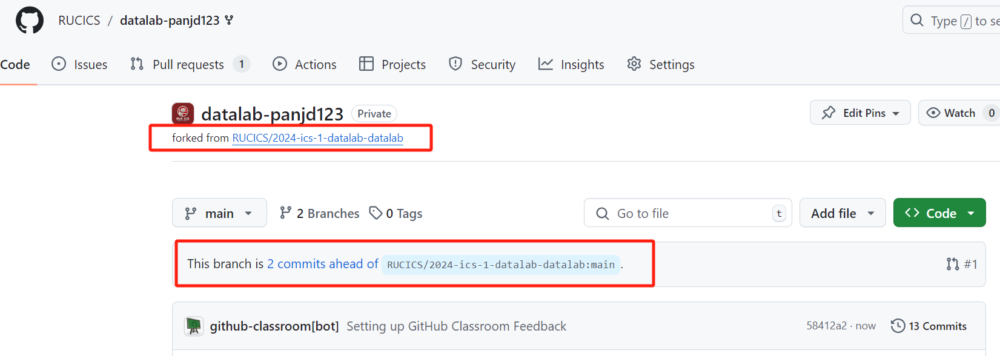
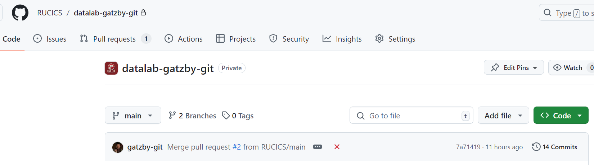
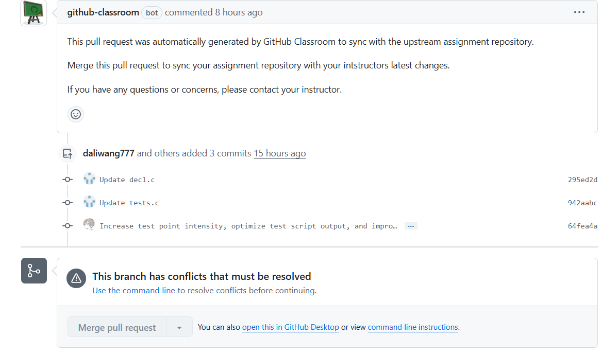
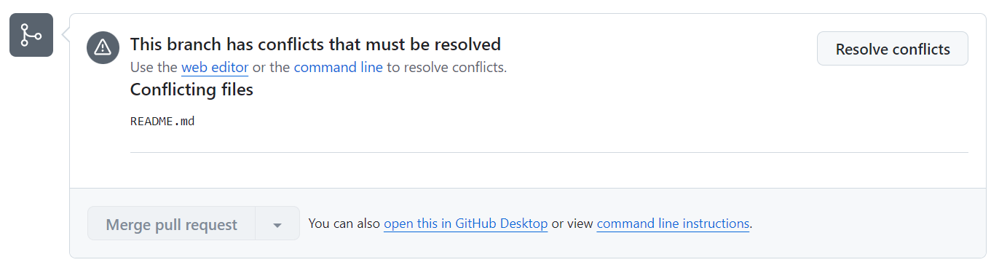

# Github Classroom 使用指南

> 该教程假设你已经阅读了 shell 和 git 章节

## Github Classroom 工作流程

1. 创建一个 Github 账号
2. 接受助教发送的作业链接，获得一个 Github 仓库
3. 完成作业并 push 到 Github 上，比如
    1. `git clone <repo url>`
    2. 完成实验，具体见不同的实验指南
    3. `git add .`
    4. `git commit -m "some message"`
    5. `git push`
4. 回到 Github 仓库，检查 Action 中的测试结果是否正确，Action 通常自动执行实验指南中提供的某脚本

## 如何合并修改

助教有时候会根据同学们的反馈对作业进行一些修改，使用 Git 可以较为方便地自动合并这些修改。

通常有两种方式完成这一工作

### 方法1：手动合并

这一功能较为完善，可以支持各种情况，比如 Github 有时检测到冲突并禁止在网页端合并，或者是 Github 有时候抽风没法发 PR 给所有同学。

该流程依赖于一个 public 状态的模板仓库，一般助教会主动在实验的开始提供，以 DataLab 为例

DataLab 的模板仓库地址为：https://github.com/RUCICS/datalab

1. 添加模板仓库地址 `git remote add template https://github.com/RUCICS/datalab`
2. `git pull template main --allow-unrelated-histories`，这一步可能需要你解决冲突，如果你不知道怎么操作，请回头查看 git 那一章的教程
3. `git push`

这个方案事实上比下文的“傻瓜方案”还要简单，而且可以解决诸多奇怪的 BUG。

一般执行方法 1 成功后，方法 2 的 PR 会显示没有冲突，你可以点一下 Merge 关闭这个 PR（理想情况下，这个 PR 不会有任何实际修改，在你方法 1 操作正确的情况下）。

### 方法2：使用 Github 主页的 PR 功能

这一功能比较傻瓜，但是会遇到诸多限制，具体来说，它的流程一般是：

1. 助教在上游仓库完成修改
2. 助教主动发 Pull Request 到所有学生的仓库中
3. 学生打开 Github 网页，点击 Pull Request，找到标题位 GitHub Classroom: Sync Assignment 的 PR
4. 如果没有冲突，它会在一段时间后，于下方显示 Merge 按钮，学生点击该按钮
5. 点击后，学生于本地执行 `git pull` 即可完成合并

### 方法3：重来解决 99% 的问题

打开自己作业的 github repo，找到 `Settings`，拉到最下方找到 `Delete this repository`，将作业仓库删除（注意在本地备份关键文件）

重新打开助教发送的作业链接，重新接受本作业，即点击 `Reaccept`

### 总结

通常，在方法 2 可以正常运作的时候，优先用方法 2。不行时试着先用方法 1 ，再用方法 2，最后的解决方案是方法 3。

## 已知的同步问题和解决方案

### 问题1：没有显示有最新的 PR，或者是没有显示同步情况

正常的仓库应该有以下几条信息显示

有时候你会发现你仓库这些地方干干净净的

这是一个不可修复的 BUG，建议重新接受一次作业来尝试修复。

如果你不想这样做，你也可以用方法 1 来同步，但也意味着你永远没办法用方法 2 来同步了。

### 问题2：This branch has conflicts that must be resolved

如果你的界面如下图，请用方法 1 同步，或者重新接受一次作业：

如果你的界面如下图，说明你的冲突被认为不严重，Github 允许你在网页端进行合并，点击右侧 Resolve conflicts 即可，具体冲突怎么处理请见 git 那章的教程：

### 问题3：意外的冲突，`Review Assignment Due Date`

多数冲突是因为你的修改和助教的修改冲突导致的，这时候你应该保留助教的修改。

一个特殊情况是 `Review Assignment Due Date`，它出现在 `README.md` 的开头，你有小概率遇到这个冲突，此时你可以删掉它，没啥用。