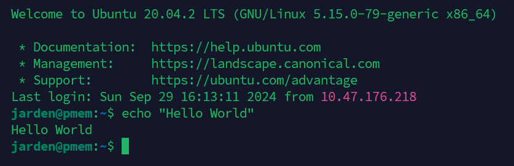

# Shell

## 什么是 Shell

电脑最初是没有可视化界面的，我们和电脑交互的方法就是输入指令，这种和可视化界面（Graphical User Interface）相对的交互方式叫做命令行界面（Command Line Interface）。有时候我们戏称它为黑框。

今天，服务器上一般只安装这种命令行界面，你默认就是用这种黑框和它交互。



> 即你开机后看到的就是一个闪动的光标，你可以在上面输入指令。

-----

命令行（也称命令，指令）指的是我们输入的具体的文字，比如用来关机的 `shutdown`。

而可以输入这些指令的软件一般叫做终端（`Terminal`）或者 `Shell`，比如 Windows 中的 `cmd` 和 `PowerShell`，Mac 中的 `Terminal`，Linux 中的 `shell`。

当然，大多数时候我们不严格区分这些概念，你只要知道，当我们提到终端，Shell，命令行这些名词时，我们指的是这种交互方式，语言或软件即可。

## 怎么打开 Shell

要进入本地命令行，或者说终端，见 [如何在Windows 11中打开Windows终端？有七种方法可供选择](https://baijiahao.baidu.com/s?id=1722119296114582505&wfr=spider&for=pc) 和 [Mac电脑打开终端的三种方法](https://baijiahao.baidu.com/s?id=1742673139907938940&wfr=spider&for=pc)。带图形化界面的 Linux 系统一般用快捷键 `Ctrl + Alt + T` 来呼出终端。

> [JS/UIX - Terminal](https://www.masswerk.at/jsuix/index.html) 是一个在线 Linux 终端，你可以用它来暂时体验常见命令。但我们仍然建议你用你的本地电脑来操作。
>
> 1. 进入网站后，点击第二行的 `open terminal`
> 2. 在 `login:` 后随便输入一个用户名，除了 `root`

以下我们逐一讲解若干常见指令的用法。

`man <command>` 展示手册页，或者叫“帮助”，即显示 `command` 指令的用法

```shell
[panjd@www.masswerk.at:2]$ man cp                                               
Synopsis:                                                                       
cp [-ipr] <sourcefile> {<sourcefile>} <target>                                  
                                                                                
copy files from source- to target-file.                                         
                                                                                
Arguments:                                                                      
    <sourcefile>  file(s) or directories to be copied                           
                  if called with multiple source-files the target must be       
                  a directory                                                   
    <target>      the file name of the new file or the name of a directory.     
                                                                                
Options:                                                                        
    -i  ignore error warnings                                                   
    -p  copy file permissions                                                   
    -r  recursive - include nested files
```

> 如何阅读：
> 
> 中括号 `[]` 表示内部的参数可以出现也可以不出现
>
> 短参数 `-i` `-p` `-r`，可以简写在一起 `-ip` 或 `-rip` 之类的
>
> 长参数 `--help`，一般以两个横杠开始，不能缩写
>
> 花括号 `{}` 表示序列，可以输入多个，一条命令只可能有一个参数能输入多个，因为他是靠顺序来判断的，比如 `cp [-ipr] <sourcefile> {<sourcefile>} <target>` 中最后一个参数就是 `<target>`，其他都当做 `<sourcefile>`
>
> 尖括号 `<>` 表示替换，比如 `cp <sourcefile> <target>` 替换后应该是 `cp file1.txt file2.txt` 而不是 `cp <file1.txt> <file2.txt>`
>
> 注意你可能在每行指令的开头见到 `#` 或者 `$`，初学者往往误以为这是指令的一部分，其实这是一个提示符而已，不要在复制指令时搞错。

`pwd` 显示当前目录

```shell
[panjd@www.masswerk.at:2]$ pwd                                                  
/home/panjd
```

`mkdir <dirname>` 创建文件夹

`touch <filename>` 创建文件

`ls` 列出当前目录下的文件和文件夹

```shell
[panjd@www.masswerk.at:2]$ mkdir test_dir
[panjd@www.masswerk.at:2]$ touch test_file.txt
[panjd@www.masswerk.at:2]$ ls
test_dir   test_file.txt
```

> 在 Windows 中的 `ls` 是 `dir`，换了个名字。

`cd <dirname>` 切换目录

```shell
[panjd@www.masswerk.at:2]$ cd test_dir
[panjd@www.masswerk.at:2]$ pwd
/home/panjd/test_dir
```

`echo <arg>` 展示 `arg` 的东西

`>` 输出重定向，把本来要输出到终端的输出到文件之类的地方

`cat` 输出文件内容

```shell
[panjd@www.masswerk.at:2]$ echo "hello"
hello                      
[panjd@www.masswerk.at:2]$ echo "hello" > hello.txt
[panjd@www.masswerk.at:2]$ cat hello.txt                                        
hello
```

`rm [-r] <filename>` 删除文件

删除文件夹需要加上参数 `-r` 表示递归地进行，具体见 `man rm`

```shell
[panjd@www.masswerk.at:2]$ ls                                                   
test_dir   test_file.txt                                                        
[panjd@www.masswerk.at:2]$ rm test_file.txt                                     
[panjd@www.masswerk.at:2]$ rm -r test_dir                                       
[panjd@www.masswerk.at:2]$ ls

```

`cp [-r] <sourcefile> <target>` 复制文件

```shell
[panjd@www.masswerk.at:2]$ ls                                                   
hello1.txt                                                                      
[panjd@www.masswerk.at:2]$ cp hello1.txt hello2.txt                             
[panjd@www.masswerk.at:2]$ ls                                                   
hello1.txt             hello2.txt
```

`mv <filename> <target>` 移动文件，或重命名文件

```shell
[panjd@www.masswerk.at:2]$ ls                                                   
hello1.txt             hello2.txt  tmp_dir                                      
[panjd@www.masswerk.at:2]$ mv hello1.txt tmp_dir/hello1.txt                     
[panjd@www.masswerk.at:2]$ ls                                                   
hello2.txt             tmp_dir                                                  
[panjd@www.masswerk.at:2]$ cd tmp_dir                                           
[panjd@www.masswerk.at:2]$ ls                                                   
hello1.txt                                                                      
[panjd@www.masswerk.at:2]$ mv hello1.txt hello3.txt                             
[panjd@www.masswerk.at:2]$ ls                                                   
hello3.txt
```

`clear` 清空屏幕

`~` 用户目录

`~` 不是一个指令，而是一个特殊的路径，在 linux 下，一般是 `/home/<username>`，在 Windows 下，一般是 `C:\Users\<username>`。

你可以这样输出查看

```shell
echo ~
```

很多时候我们的路径会包含 `~`，你需要知道它代表什么，比如 `~/.bashrc` 指的其实是 `/home/<username>/.bashrc` 文件

## 练习

题目：创建一个文件夹 `test_dir`，在里面创建一个文件 `test.txt`，并在文件中写入 `hello world`，输出文件中的内容，最后显示自己的当前目录。

答案：

```shell
mkdir test_dir
cd test_dir
touch test.txt
echo "hello world" > test.txt
cat test.txt
pwd
```

## vi, vim 或 nano

你也许会发现终端中编辑文件是一个痛苦的事情，有一些程序可以帮助你编辑文件，比如 `vi`, `vim` 或 `nano`。

【每天一个Linux命令-vi】 https://www.bilibili.com/video/BV1Eu4y117y3/?share_source=copy_web&vd_source=7a01f17cc0a9cd546dd117967834433e

本视频非常重要，你至少要学会怎么进入 vi，选择某行编辑，保存，退出。

## 真正的开始

该文档只是囫囵吞枣，接下来，请跟随微软的小教程 [bash-introduction](https://learn.microsoft.com/zh-cn/training/modules/bash-introduction/) 来进一步学习。本教程还需要你掌握 vi。

## 后记

当你在之后的计算机学习过程中，遇到让你输入某指令，一般就是指在命令行界面下操作。

在 VSCode 中，你可以按 ``Ctrl + ` `` 在当前工作区打开终端。

所谓在某个位置打开终端，就是指你打开终端后，你的 `pwd` 指令返回的路径是这个位置。

Shell 往往也指代一种脚本语言，除了这种简单的单条语句，你也可以用 `for` 和变量来写一些复杂的功能。
